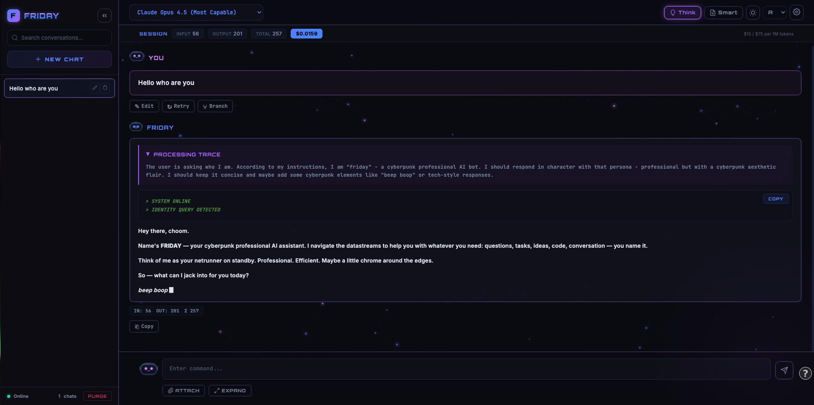
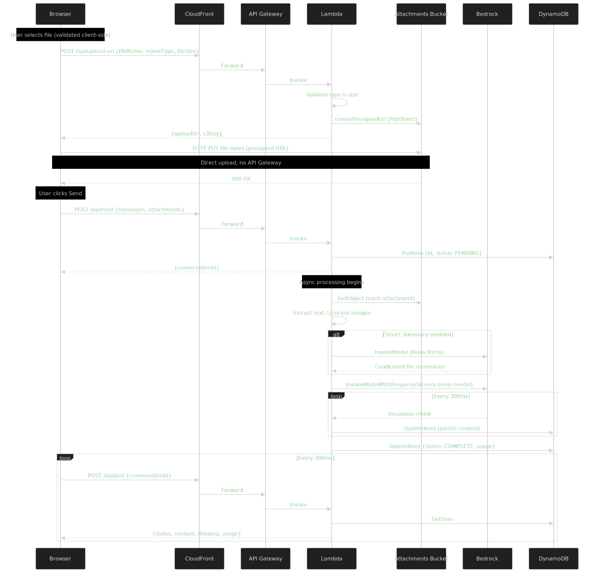

# Deploy a Perplexity-Like AI Chat Interface with Web Search, Voice Input, and Multi-Model Selection on AWS — In Minutes

> 🔗 **Try the live demo:** [www.whyshock.com/apps/friday](http://www.whyshock.com/apps/friday/index.html)
> 📧 **Want the deployment scripts?** Contact **i@whyshock.com** to get the source code and deploy FRIDAY to your own AWS account.

Here, I'm sharing **FRIDAY**, an open-source, fully serverless AI chatbot that you can deploy to your own AWS account in under 10 minutes. It gives you a Perplexity-style chat interface with access to 20+ AI models — Anthropic Claude 4.x, 3.7, 3.5, Amazon Nova, and any custom Amazon Bedrock model ID — all from a single dropdown. No API keys, no SaaS subscriptions, no servers to manage.

FRIDAY supports web search with citations (DuckDuckGo built-in, Brave Search API optional), voice input via the Web Speech API, large file attachments up to 100 MB (PDFs, Office documents, code files, images), real-time streaming responses, extended thinking mode, conversation branching, a smart file summarizer that cuts token costs by up to 90%, and live session cost tracking. The entire infrastructure is defined in a single AWS CloudFormation template.

As someone who has been juggling between multiple AI chat subscriptions — each with their own data policies and limitations — I wanted a single self-hosted interface where my data stays in my browser, I can switch models mid-conversation, and I only pay for the tokens I actually use. So I built FRIDAY, and in this post I'll walk you through the architecture, the key design decisions, and how to deploy it yourself.

## FRIDAY in action

Here's what the interface looks like when you're chatting with Claude Opus 4.5 with extended thinking enabled:



Here's the short video clip of firday in action!:
<p align="center">
  <video src="https://github.com/user-attachments/assets/7bfd6b98-3efb-4c31-b8a3-6682ec295154" width="80%" controls></video>
</p>


Let me walk you through what you're seeing in this screenshot.

At the top left, the **FRIDAY** logo with its glitch-text animation sits above a searchable conversation sidebar. The sidebar lists your chat history, and each conversation can be renamed, deleted, or branched. The green "Online" indicator at the bottom confirms the Lambda backend is reachable.

The header bar is where the action is. The **model selector** dropdown shows "Claude Opus 4.5 (Most Capable)" — you can switch to any of the 20+ available models mid-conversation. To the right, the **THEME** button toggles light/dark mode, the **SIZE** dropdown adjusts text size, and the **CONFIG** gear opens the settings panel.

Just below the header, the **session cost bar** shows real-time token usage and cost with a themed gradient design: `SESSION | INPUT: 96 | OUTPUT: 201 | TOTAL: 257 | $0.0159` with the per-token rate displayed on the right. This updates after every response so you always know what you're spending.

The chat area shows a conversation in progress. The user message appears in a card with a purple-accented border and an animated human avatar — a cyberpunk hacker figure with glowing lavender visor eyes. Below the message, **Edit** and **Copy** buttons let you modify or copy the input. On the assistant's response, **Branch**, **Retry**, and **Copy** buttons let you fork the conversation or regenerate.

FRIDAY's response is the interesting part. Because Think mode is enabled, you can see the **PROCESSING TRACE** block in green monospace text — this is the model's internal reasoning chain, showing exactly how it decided to respond.

At the bottom, the input area features the human avatar with a typing indicator dot, a text field with the placeholder "Enter command...", and a compact send button beside the textarea. Below the textarea, a row of controls includes **Think**, **Smart**, and **Search** toggles on the left, and **ATTACH**, **EXPAND**, and **VOICE** buttons on the right. Floating particles drift across the dark background, and subtle scanline overlays give the whole interface that CRT-monitor cyberpunk feel.

Everything you see here — the avatars, the glitch effects, the particle canvas, the gradient borders — is pure CSS and inline SVG. No images, no external assets. The entire frontend is three files with zero build step.

## Architecture overview

FRIDAY runs entirely on AWS serverless services. There are no EC2 instances, no containers, no servers to patch or scale. Here's the high-level architecture:



Seven AWS services work together, each chosen for a specific reason:

| Service | Role | Why this choice |
|---------|------|-----------------|
| **S3** (Website) | Hosts the static frontend | Private bucket with Origin Access Control — CloudFront-only access |
| **S3** (Attachments) | Temporary file storage | AES-256 encryption, 24-hour auto-delete lifecycle, presigned URL uploads bypass API Gateway's 10 MB limit |
| **CloudFront** | CDN, HTTPS, routing | Single domain for static files and API — no CORS issues. HTTP/2, compression, global edge caching |
| **API Gateway** (HTTP API v2) | Routes `/api/*` to Lambda | Lower latency and cost than REST API. 30-second timeout is fine because Lambda returns immediately |
| **Lambda** | Business logic + web search | 2 GB RAM + 1 GB ephemeral storage handles 100 MB file processing. 5-minute timeout for long model responses. Performs web search via DuckDuckGo/Brave |
| **DynamoDB** | Streaming state | On-demand billing scales to zero. 30-minute TTL auto-cleans records. Stores search results and sources alongside response content |
| **Amazon Bedrock** | AI inference | Managed LLM access — no GPUs to manage. Cross-region routing based on model ID prefix |

## Web search — grounded responses with citations

One of the features I'm most excited about is web search integration. When you enable the **Search** toggle below the textarea, FRIDAY searches the web for relevant information before generating a response. The AI then cites its sources with numbered markers like [1], [2], etc., and you can see exactly where each fact came from.

Here's how it works under the hood:



FRIDAY uses a two-tier search strategy:

- **DuckDuckGo** (default) — No API key needed. Uses the DuckDuckGo HTML lite endpoint, parses the results page, and extracts titles, URLs, and snippets. Works out of the box with zero configuration.
- **Brave Search API** (optional upgrade) — If you provide a Brave API key in the CONFIG settings panel, FRIDAY uses it for richer, more structured results. If Brave fails, it falls through to DuckDuckGo automatically.

The search query is extracted from the user's conversational message by stripping filler words ("hey friday, can you tell me about...") to produce a clean search query. Results are formatted as numbered `[Web Source N]` blocks and injected into the Bedrock prompt alongside a citation instruction that tells the model to reference sources with `[1]`, `[2]` markers.

On the frontend, citation markers in the response become clickable links. A collapsible **Sources** panel appears below the response showing each source with its title, domain, snippet, and a "🔍 Searched: [query]" indicator so you can see exactly what was searched.

The search query and sources are stored in DynamoDB alongside the response content, so they persist through the polling cycle and are available when the response completes.

## Voice input — talk to FRIDAY

FRIDAY supports voice input through the browser's Web Speech API. Click the **VOICE** button in the input actions bar, and FRIDAY starts listening. Speak your message, and it appears as a live preview above the textarea. When you're done, the transcribed text is inserted into the input field ready to send.

The voice feature uses the `SpeechRecognition` API (or `webkitSpeechRecognition` for Chrome/Safari). It supports continuous recognition with interim results, so you see your words appearing in real time as you speak. The mic button pulses with a recording animation while active, and you can click it again to stop.

Voice input integrates cleanly with the rest of the UI — if you're recording and click send, the recording stops automatically and the current transcript is sent. The VOICE button hides during loading states to avoid confusion.

## How streaming works — the fire-and-poll pattern

Here's the core engineering challenge I had to solve: API Gateway has a hard 30-second integration timeout, but a Claude Opus response can take over 2 minutes. You can't stream a long response through API Gateway in a single HTTP connection.

FRIDAY solves this with what I call a "fire-and-poll" pattern:



Here's the step-by-step flow:

1. The browser sends a chat request to `/api/chat` with the conversation history, model selection, any file attachment metadata, and web search preferences.
2. Lambda creates a `PENDING` record in DynamoDB and returns a `conversationId` — this happens in under 1 second.
3. Lambda then kicks off `processConversation()` asynchronously (without awaiting it). If web search is enabled, it first performs the search and formats results as context. Then it calls Bedrock's streaming API and writes accumulated text chunks to DynamoDB every 300 milliseconds.
4. Meanwhile, the browser starts polling `/api/poll` every 300 milliseconds with the `conversationId`.
5. Each poll returns the latest accumulated content, plus any search sources and the search query. The UI renders it incrementally, so it feels like real-time streaming.
6. When Lambda finishes receiving the full response from Bedrock, it marks the DynamoDB record as `COMPLETE` and includes token usage statistics, search sources, and the search query.
7. The browser detects the `COMPLETE` status, stops polling, renders citations as clickable links, and displays the sources panel.

This pattern means responses of any length are supported — the Lambda can run for up to 5 minutes. The UI never freezes. And the architecture is fully stateless from API Gateway's perspective. DynamoDB records auto-expire after 30 minutes via TTL, so there's zero cleanup needed.

## File attachments — from browser to Bedrock

FRIDAY supports uploading files up to 100 MB each, with up to 5 files per message. This includes PDFs, Word documents, Excel spreadsheets, PowerPoint presentations, code files in 12+ languages, log files, images, and more — 35+ file types in total.

The challenge here is that API Gateway has a 10 MB payload limit. To support 100 MB files, the browser uploads directly to S3 using a presigned PUT URL. The file never touches API Gateway or Lambda during upload. Here's how the flow works:



When the user selects a file, the frontend first validates the file type and size client-side. It then requests a presigned URL from the Lambda, which validates again server-side (defense in depth). The browser uploads the file directly to S3 using an XMLHttpRequest with progress tracking — you see a neon cyan progress bar filling up in real time.

When the user sends the message, only lightweight metadata (S3 key, filename, MIME type) is included in the chat request. Lambda retrieves the file from S3 and processes it based on its type:

| File type | Processing strategy | Dependency |
|-----------|-------------------|------------|
| Text files (TXT, MD, CSV, JSON, XML, YAML, HTML, code, logs) | Read as UTF-8 | None |
| PDF | Text extraction | `pdf-parse` |
| DOCX | Unzip, parse `word/document.xml`, strip XML tags | `adm-zip` |
| XLSX | Unzip, parse shared strings + worksheet XML | `adm-zip` |
| PPTX | Unzip, parse slide XML, strip tags | `adm-zip` |
| Images (JPEG, PNG, GIF, WebP) | Base64-encode for Bedrock multimodal | None |

Extracted text is wrapped in tagged format so the AI knows which file each section belongs to:

```
[File: server.log]
2024-01-15 10:23:45 ERROR Connection timeout to database...
2024-01-15 10:23:46 WARN Retrying connection (attempt 2/3)...
[/File: server.log]
```

The prompt is constructed with a specific ordering: image content blocks first, then file text blocks, then the user's message. This gives the model full file context before it reads the question. If the total prompt approaches the model's context window limit, the oldest files are truncated first — preserving the most recent files and the user's question.

## Smart Summary — reducing token costs by up to 90%

One of the design decisions I'm most pleased with is the Smart Summary feature. When you upload a large file — say, a 50-page PDF with 80,000 characters of extracted text — sending all of that to Claude Opus at $15 per million input tokens gets expensive quickly.

When you enable the "Smart" toggle below the textarea, FRIDAY pre-processes large files through Amazon Nova Micro (the cheapest Bedrock model at $0.035 per million input tokens) before sending to your chosen model.



Nova Micro receives the file content along with your question, so it knows what's relevant, and produces a structured summary — key facts, numbers, structure, patterns, anomalies.

The summary, not the full text, then gets sent to your main model. Files under 2,000 characters are skipped (already small enough). If summarization fails for any file, the raw text is used instead — graceful degradation, always.

Here are the token savings I've observed in practice:

| File | Raw characters | After summary | Reduction |
|------|---------------|---------------|-----------|
| 50K code file | ~50,000 | ~3,000 | 94% |
| 80K PDF report | ~80,000 | ~5,000 | 94% |
| 10K log file | ~10,000 | ~2,000 | 80% |
| 1.5K config file | ~1,500 | ~1,500 (skipped) | 0% |

The Smart Summary toggle auto-enables when you attach a file larger than 1 MB. You can always toggle it off if you want the model to see the raw content.

## Multi-model selection and inference tuning

FRIDAY gives you access to the full range of Amazon Bedrock models from a single dropdown:

- **Claude 4.x** — Opus 4.5 (most capable), Sonnet 4.5, Haiku 4.5 (fastest), Opus 4, Sonnet 4
- **Claude 3.7** — Sonnet with extended thinking support (US and EU regions)
- **Claude 3.5** — Sonnet v2 (default), Sonnet v1, Haiku
- **Claude 3** — Opus, Sonnet, Haiku (legacy)
- **Amazon Nova** — Pro, Lite, Micro
- **Custom** — Enter any Bedrock model ID in Settings

Beyond model selection, you get three response style presets that auto-tune inference parameters:

| Style | Temperature | Top P | Best for |
|-------|-------------|-------|----------|
| Precise | 0.10 | 0.15 | Code, factual Q&A, technical tasks |
| Balanced | 0.50 | 0.50 | General use, analysis, summaries |
| Creative | 0.90 | 0.85 | Brainstorming, writing, ideation |

You can also manually tune Temperature, Top P, Top K, and Max Tokens through the advanced settings panel. For thinking-capable models (Claude 3.7+, Claude 4.x), Top P values are automatically adjusted because the extended thinking API requires higher values to function correctly.

When you enable the "Think" toggle for a supported model, FRIDAY allocates a 16,000-token thinking budget. The model reasons through the problem step-by-step before responding, and you can see the full reasoning chain in a collapsible block above the answer.

## The cyberpunk UI

I wanted FRIDAY to feel different from the standard chat interfaces. The design system is built around a cyberpunk aesthetic — near-black backgrounds, soft royal blue and lavender accents with glow effects, scanline overlays, particle canvas, glitch-text animations, and animated SVG avatars.

The frontend is framework-free: vanilla JavaScript, no React, no build step. Three files — `index.html`, `app.js`, and `style.css`. External libraries are loaded via CDN: `marked.js` for Markdown rendering, `highlight.js` for syntax highlighting, and KaTeX for LaTeX math.

Some of the visual details:

- **Particle canvas** — A `<canvas>` element behind everything with floating particles
- **Scanline overlay** — CSS repeating gradient creating subtle CRT scanlines
- **Gradient borders** — Interactive elements have animated gradient borders using the `mask-composite: exclude` technique
- **Holographic shimmer** — Message cards shimmer on hover via background-position animation
- **Animated avatars** — Both the bot and human avatars are inline SVGs with CSS blink cycles, processing states, and typing indicators
- **Light mode** — The entire design system flips cleanly via CSS custom property overrides
- **Readable text** — Message content uses standard colors (white in dark mode, dark in light mode) for comfortable reading, while the cyberpunk accents are reserved for UI chrome

The UI layout is carefully organized:

- **Header bar** — Model selector, THEME button, SIZE dropdown, CONFIG button — all with visible text labels
- **Input area** — Textarea with a compact send/stop button beside it, and a row of controls below: Think/Smart/Search toggles on the left, ATTACH/EXPAND/VOICE buttons on the right
- **Message actions** — Edit and Copy on user messages; Branch, Retry, and Copy on assistant responses
- **Session cost bar** — Themed gradient design with real-time token counts and USD cost estimate

The UI also includes conversation branching (edit a message and resend to create a parallel branch), full-text search across conversation history, keyboard shortcuts (Ctrl+N for new chat), paste-to-attach images, and a live session cost tracker showing input tokens, output tokens, and estimated USD cost.

## Getting started

To deploy FRIDAY, you need an AWS account with Bedrock model access enabled, AWS CLI v2 configured, and bash.

**Step 1 — Clone and deploy:**

```bash
cd friday
chmod +x deploy.sh
./deploy.sh
```

That's it. The deploy script handles everything:

1. Packages the Lambda function (installs npm dependencies, creates a zip)
2. Checks for stuck CloudFormation states and cleans up if needed
3. Deploys the CloudFormation stack (creates all seven AWS services)
4. Uploads the Lambda code to S3 and updates the function
5. Uploads the frontend files to S3
6. Invalidates the CloudFront cache
7. Prints your live URL

You can also specify a custom stack name and region: `./deploy.sh my-friday us-east-1`

**Step 2 — Open the URL:**

The script prints a CloudFront URL like `https://d1234abcdef.cloudfront.net`. Open it in your browser, select a model from the dropdown, and start chatting. CloudFront may take a few minutes to propagate on first deploy.

**Step 3 — (Optional) Customize:**

Open CONFIG (gear icon) to set a system prompt, choose a response style, tune inference parameters, configure a Brave Search API key for richer web search results, or enter a custom Bedrock model ID.

## What gets created

The single `cloudformation.yaml` provisions everything:

```
WebsiteBucket           — S3 bucket for static frontend (private, OAC)
WebsiteBucketPolicy     — Allows CloudFront access only
AttachmentsBucket       — S3 bucket for file uploads (AES-256, 24h auto-delete)
ConversationsTable      — DynamoDB table (on-demand, 30-min TTL)
LambdaExecutionRole     — IAM role (Bedrock + DynamoDB + S3, minimal scope)
ChatLambdaFunction      — Lambda function (Node.js 20, 2 GB, 5-min timeout)
HttpApi                 — API Gateway HTTP API v2 with CORS
4 API routes            — /api/chat, /api/poll, /api/upload-url, /api/health
CloudFrontDistribution  — CDN with S3 + API Gateway origins
```

The Lambda backend is five files with two npm dependencies (`pdf-parse` for PDF extraction, `adm-zip` for Office document processing):

- `index.js` — Route handler, Bedrock streaming, DynamoDB state management, web search orchestration
- `webSearch.js` — Dual-tier web search (DuckDuckGo + Brave), query extraction, citation prompt injection
- `fileProcessor.js` — Text extraction from PDFs, Office docs, code files, plus Smart Summary logic
- `promptBuilder.js` — Bedrock prompt construction handling Claude vs Nova format differences
- `validation.js` — File type and size validation with extension-based fallback

A `rollback.sh` script is also included for inspecting stack status, rolling back Lambda to a previous version, or performing a full teardown.

## Things to know

Here are some important considerations:

**Cost** — The AWS infrastructure costs effectively $0–2 per month for personal use, thanks to free tiers on Lambda, DynamoDB, and API Gateway. You pay for Bedrock tokens on a per-use basis. Claude Sonnet models cost $3 per million input tokens and $15 per million output tokens. Amazon Nova Micro costs $0.035 per million input tokens. FRIDAY includes a live session cost tracker so you always know what you're spending. Typical personal usage runs $5–30 per month depending on model choice and frequency.

**Web search** — DuckDuckGo search works out of the box with no API key. For richer results, you can optionally configure a Brave Search API key in the CONFIG panel. The key is stored in your browser's localStorage and sent with each request — it never touches server-side storage.

**Voice input** — Voice input uses the browser's built-in Web Speech API. It works in Chrome, Edge, and Safari. Firefox has limited support. No external services or API keys are needed — all speech recognition happens locally in the browser.

**Security** — Conversation history is stored only in your browser's localStorage — it never leaves your device. Both S3 buckets are fully private with no public access. File uploads use presigned URLs with 15-minute expiry, and uploaded files are automatically deleted after 24 hours. The attachments bucket uses AES-256 server-side encryption. Lambda uses IAM roles with minimal permissions — no API keys or secrets in code. HTTPS is enforced by CloudFront.

**Authentication** — FRIDAY is designed for personal or internal use. There is no built-in authentication — anyone with the CloudFront URL can use it. For production or team use, I recommend adding Amazon Cognito, CloudFront signed URLs, or an API Gateway authorizer. You can also add AWS WAF rate-based rules to the CloudFront distribution.

**Data privacy** — No conversation data is persisted server-side. DynamoDB is used only as a temporary streaming buffer with a 30-minute TTL. The DynamoDB table has `DeletionPolicy: Retain` to protect any in-flight data if the stack is accidentally deleted.

**Error handling** — The system is designed for graceful degradation. If a PDF fails to extract, an error notice is included in the prompt instead of crashing. If Smart Summary fails for a file, the raw text is used. If web search fails, the model responds from its training data. If one attachment in a batch fails to process, the others still work. The frontend shows specific error messages for each failure type with retry buttons where applicable.

## How FRIDAY compares

| | ChatGPT | Perplexity | Claude.ai | FRIDAY |
|---|---------|-----------|-----------|--------|
| Multi-model | GPT only | Multiple (limited) | Claude only | 20+ models, any Bedrock ID |
| Self-hosted | No | No | No | Your AWS account |
| Data privacy | Their servers | Their servers | Their servers | Browser localStorage only |
| Web search | Yes | Yes | No | Yes (DuckDuckGo + Brave) |
| Voice input | Yes | No | No | Yes (Web Speech API) |
| Citations | Limited | Yes | No | Yes, with sources panel |
| File support | Limited | Limited | Limited | 35+ types, up to 100 MB |
| Smart file summary | No | No | No | Yes (80-90% token savings) |
| Cost model | $20/mo subscription | $20/mo subscription | $20/mo subscription | Pay-per-token (~$5-30/mo) |
| Inference tuning | None | None | None | Full control |
| Extended thinking | No | No | Yes | Yes, with visible reasoning |
| Conversation branching | No | No | No | Yes |
| Real-time cost tracking | No | No | No | Yes |

## What's next

I'm exploring several additions: optional DynamoDB-backed conversation sync for multi-device access, voice output via Amazon Polly, WebSocket streaming to replace polling, document indexing for RAG over your own files, and Cognito authentication for team deployments.

Give it a try — if you want the deployment scripts and source code, reach out to me at **i@whyshock.com** and I'll get you set up.

– Vaishakh Kuppast
